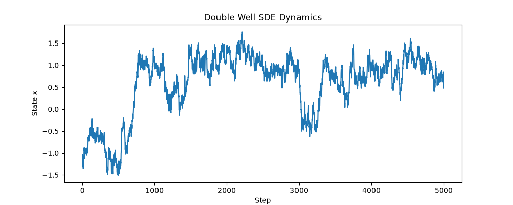
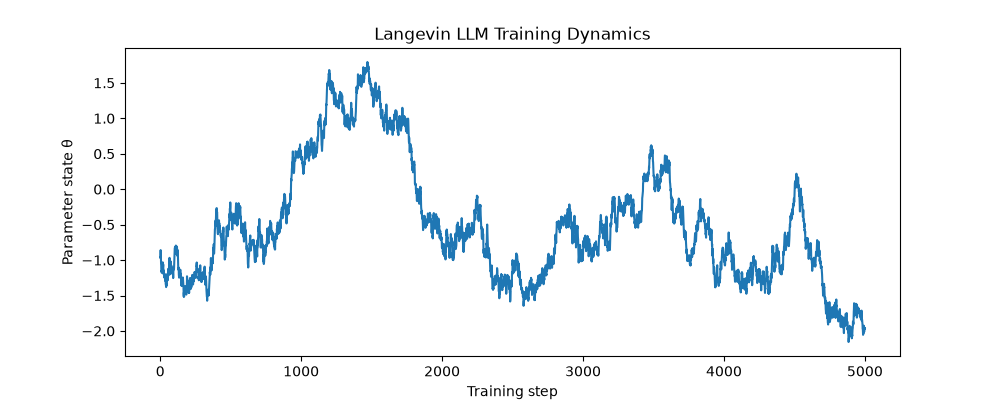

# LLM Training Dynamics Stability Monitor


## 🎯 Project Overview

本项目尝试从随机动力系统视角研究大模型（LLM）训练过程中的稳定性问题。

核心思想是将 SGD/Adam 优化过程视为高维随机演化系统：

\[
dX_t=b(X_t)dt+\sigma dW_t
\]

其中：

- \(X_t\)：训练状态变量；
- \(b(X_t)\)：优化过程中的确定性演化项；
- \(\sigma dW_t\)：由随机梯度、数据采样等因素引入的随机扰动。

项目目标是构建一个具有数学解释性的 LLM 训练稳定性分析框架，用于识别和预测：

- Loss Spike
- Gradient Explosion
- Training Instability
- Optimization Divergence


区别于传统仅依赖经验指标的训练监控方法，本项目引入随机过程理论中的：

- 随机微分方程（Stochastic Differential Equation, SDE）
- 遍历理论（Ergodic Theory）
- 占位测度分析（Invariant Measure）
- 大偏差理论（Large Deviation Theory）

尝试建立可解释的“训练稳定性雷达”。

---

# 📖 Project Motivation

现代大模型训练具有：

- 参数规模巨大；
- 优化过程高度随机；
- 训练状态动态变化复杂。


传统训练监控方法主要依赖：

- Loss 曲线监测；
- Gradient Norm；
- Gradient Clipping；
- Learning Rate Scheduling。


这些方法能够发现异常，但对于以下问题缺少理论解释：

- 为什么训练过程会突然失稳？
- 系统距离临界状态还有多远？
- Loss Spike 是否可以提前预测？


本项目将 SGD/Adam 优化过程建模为随机动力系统：

\[
\theta_{k+1}
=
\theta_k-\eta\nabla L(\theta_k)+\xi_k
\]


并进一步研究：

- 训练状态的长期统计分布；
- 随机系统稳定性；
- 稀有异常事件发生概率。


---

# 🛠️ Technical Stack


## Programming Language

- Python


## Numerical Computing

- NumPy
- SciPy
- Pandas


## Visualization

- Matplotlib
- Plotly


## Deep Learning Interface

- PyTorch（规划接入）


用于获取真实 LLM 训练过程中的：

- Loss
- Gradient Norm
- Learning Rate
- Parameter Statistics


## Mathematical Methods

- Euler-Maruyama 数值积分
- Langevin Dynamics
- Ergodicity Analysis
- Invariant Measure Estimation
- Large Deviation Principle


---

# 📂 Project Structure


```text
LLM-Training-Dynamics-SDE

│
├── README.md
├── requirements.txt
├── LICENSE
│
├── 01_baseline_sde
│
│   ├── double_well.py
│   │       # 基础亚稳态随机系统模拟
│   │       # 验证随机跃迁与稀有事件现象
│   │
│   └── visualize.py
│           # SDE轨迹可视化
│
│
├── 02_training_dynamics
│
│   ├── langevin_llm.py
│   │       # 基于Langevin动力学的SGD随机过程模拟
│   │
│   ├── training_state.py
│   │       # 构造LLM训练状态变量
│   │
│   ├── state_sde.py
│   │       # 多维训练状态随机动力系统
│   │
│   └── visualize_state.py
│           # 训练状态演化可视化
│
│
├── 03_stability_analysis
│
│   ├── invariant_measure.py
│   │       # 训练状态经验占位测度估计
│   │
│   ├── ergodicity.py
│   │       # 遍历性与混合性质分析
│   │
│   └── large_deviation.py
│           # 稀有训练异常事件概率分析
│
│
└── 04_llm_demo
    │
    ├── data_loader.py
    │       # 训练日志数据接口
    │
    └── stability_monitor.py
            # LLM训练稳定性监测系统
```

---

# 🚀 Quick Start


## 1. Clone Repository

```bash
git clone https://github.com/liuke-research/llm-training-dynamics-sde.git

cd llm-training-dynamics-sde
```


## 2. Create Environment


推荐使用 Conda：

```bash
conda create -n llm-sde python=3.11

conda activate llm-sde
```


## 3. Install Dependencies


```bash
pip install -r requirements.txt
```


## 4. Run Demo


### 基础随机动力系统

```bash
python 01_baseline_sde/visualize.py
```
## Double Well Stochastic Dynamics

Baseline stochastic transition simulation.




### Langevin训练动力学模拟

```bash
python 02_training_dynamics/visualize.py
```
## Demo Results

### Langevin Training Dynamics

![Langevin]

## Demo Results

### Langevin Training Dynamics


---

# 🗓️ Roadmap


## ✅ Step 1 (2026.08)

项目初始化与随机动力系统基础验证：

- GitHub仓库搭建；
- Euler-Maruyama随机积分实现；
- Double Well亚稳态系统模拟；
- 随机跃迁过程可视化。


## 🚧 Step 2 (2026.08)

LLM训练动力学建模：

- Langevin SGD动力学模拟；
- 多维训练状态空间构造；
- Loss、Gradient、Sharpness等状态变量建模。


## 🔜 Step 3

训练稳定性数学分析：

- 训练状态占位测度估计；
- 遍历性与混合时间分析；
- 基于大偏差理论的异常事件预测。


## 🔜 Step 4

LLM训练稳定性Demo：

- PyTorch训练日志接入；
- Stability Score计算；
- Loss Spike提前预警。


---

# 📌 Research Pipeline


```text
Training Logs

        ↓

Training State Representation

        ↓

Stochastic Dynamical System

        ↓

Invariant Measure + Ergodicity Analysis

        ↓

Large Deviation Risk Estimation

        ↓

Training Stability Monitor
```


---

# 🎯 Research Direction


本项目希望建立一个面向大模型训练稳定性的数学分析框架：

从随机动力系统角度理解：

- 训练收敛；
- 状态转移；
- 稀有异常事件；
- 稳定性风险。


长期目标是构建：

一个能够结合训练日志数据，对 LLM 训练过程进行稳定性评估和异常预警的分析工具。


---

# 📧 Contact


**Name:** 刘珂


**Email:** 15030368689@163.com


## Research Interests

- LLM Training Stability
- Reinforcement Learning Dynamics
- Stochastic Optimization
- AI System Modeling
- Stochastic Dynamical Systems
- Large Language Model Training
